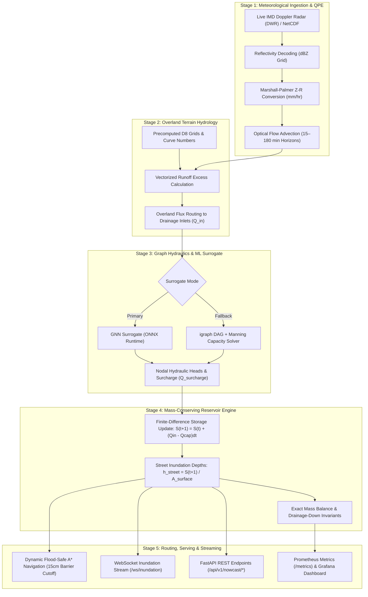

# Urban Flood Nowcasting Engine (`urban_flood_engine`)

[](https://www.python.org/downloads/)
[](https://fastapi.tiangolo.com)
[](https://onnxruntime.ai/)
[](https://igraph.org/)
[](https://postgis.net/)
[](https://www.docker.com/)
[](https://opensource.org/licenses/MIT)

A production-grade, sub-minute **Urban Flood Nowcasting and Emergency Navigation Engine** engineered for metropolitan scale. The system integrates real-time Doppler Weather Radar (DWR) quantitative precipitation estimation (QPE), high-resolution DEM terrain routing (`pyflwdir`), offline EPA-SWMM dynamic-wave hydrodynamic modeling, Graph Neural Network (GNN) surrogate inference (`ONNX Runtime`), finite-difference mass-conserving reservoir routing depth updates, and flood-safe A* shortest path navigation with impassable barrier cutoffs.

---

## 📑 Table of Contents

- [Key Architectural Highlights](#-key-architectural-highlights)
- [Multi-City Scaling Architecture](#-multi-city-scaling-architecture)
- [End-to-End Project Flows (Stages 1–5)](#-end-to-end-project-flows-stages-15)
  - [System Flow Architecture Diagram](#system-flow-architecture-diagram)
  - [Stage 1: Meteorological Ingestion & Radar QPE](#stage-1-meteorological-ingestion--radar-qpe)
  - [Stage 2: Surface Terrain Hydrology & Overland Routing](#stage-2-surface-terrain-hydrology--overland-routing)
  - [Stage 3: GNN Surrogate Inference & Hydraulic Graph Solver](#stage-3-gnn-surrogate-inference--hydraulic-graph-solver)
  - [Stage 4: Mass-Conserving Reservoir-Routing Depth Engine](#stage-4-mass-conserving-reservoir-routing-depth-engine)
  - [Stage 5: Street Inundation Mapping, Routing & Live Broadcasting](#stage-5-street-inundation-mapping-routing--live-broadcasting)
- [Technology Stack](#-technology-stack)
- [Repository Structure](#-repository-structure)
- [Mathematical & Hydraulic Formulations](#-mathematical--hydraulic-formulations)
- [Operational Processes & Step-by-Step Guide](#-operational-processes--step-by-step-guide)
  - [1. Environment & Dependency Setup](#1-environment--dependency-setup)
  - [2. Multi-City Provisioning & Data Ingestion](#2-multi-city-provisioning--data-ingestion)
  - [3. Offline SWMM Ground Truth, GNN Training & Calibration](#3-offline-swmm-ground-truth-gnn-training--calibration)
  - [4. Database Setup & Alembic Migrations](#4-database-setup--alembic-migrations)
  - [5. Running the Application](#5-running-the-application)
  - [6. Docker Compose Multi-Service Deployment](#6-docker-compose-multi-service-deployment)
  - [7. Running Automated Test Suite](#7-running-automated-test-suite)
- [API & WebSocket Reference](#-api--websocket-reference)
- [Observability & Monitoring](#-observability--monitoring)

---

## ⚡ Key Architectural Highlights

| Component | Technical Implementation | Performance & Reliability Highlights |
|---|---|---|
| **Physics vs. ML Split** | Offline SWMM dynamic-wave $\to$ Online ONNX GNN surrogate | Sub-millisecond neural surrogate inference for 15–180 min horizons vs. hours for full dynamic-wave PDE solvers. |
| **Real IMD Radar Ingestion** | Live IMD Doppler Weather Radar (DWR) scraping & color-map decoding | Native support for 6+ Indian metropolitan stations with automatic radar staleness detection (>15 min fallback). |
| **Terrain Routing** | Vectorized D8 flow directions & Curve Numbers (`pyflwdir`) | Subcatchment overland routing precomputed on DEM GeoTIFFs; zero runtime terrain recomputation per cycle. |
| **Graph Hydraulics** | `igraph` C-core graph engine + Manning pipe capacity solver | Instant topological sorting and fallback hydraulic solving scaling to 50k+ nodes/conduits. |
| **Depth Inundation** | Finite-difference mass-conserving reservoir routing ($S(t+1) = \max(0, S(t) + (Q_{in} - Q_{cap})\Delta t)$) | Enforces strict conservation of water volume; captures real-world ponding accumulation and post-storm drainage-down. |
| **Flood-Safe Navigation** | Dynamic quadratic cost penalty & 15 cm barrier cutoff | Automatically routes vehicles around hazardous flooded roads with sub-second A* search and route caching. |
| **Multi-Tenancy** | Dynamic `CityEngineRegistry` with lazy engine loading | Independent, decoupled provisioning and execution across multiple metropolitan regions. |
| **Task Queue & Serving** | FastAPI + ARQ + Redis + PostgreSQL/PostGIS/TimescaleDB | Fully async pipeline with WebSockets streaming and Prometheus/Grafana observability. |

---

## 🌐 Multi-City Scaling Architecture

The engine features a native **Multi-City Architecture** allowing isolated provisioning, training, and execution across metropolitan regions without cross-talk or shared-state corruption.

```
                    ┌────────────────────────────────────────────────────────┐
                    │                   CityEngineRegistry                   │
                    │        (Thread-Safe Dynamic Engine Lazy Loader)        │
                    └───────────┬────────────────────────────────┬───────────┘
                                │                                │
                 ┌──────────────┴──────────────┐  ┌──────────────┴──────────────┐
                 │  Hyderabad Engine Instance  │  │   Mumbai Engine Instance    │
                 │  • Radar: HYD (caz_hyd)     │  │  • Radar: MUM (caz_mum)     │
                 │  • DEM Cache: EPSG:32643    │  │  • DEM Cache: EPSG:32643    │
                 │  • GNN Model: hyd_gnn.onnx  │  │  • GNN Model: mum_gnn.onnx  │
                 │  • Network: Hussain Sagar   │  │  • Network: Mithi River     │
                 └─────────────────────────────┘  └─────────────────────────────┘
                                │                                │
                 ┌──────────────┴──────────────┐  ┌──────────────┴──────────────┐
                 │    Chennai, Delhi, etc.     │  │  Custom City Provisioning   │
                 │  • Multi-Horizon Nowcasting │  │  • python -m ingest_city    │
                 └─────────────────────────────┘  └─────────────────────────────┘
```

### Pre-Configured Metropolitan Profiles:
1. **Hyderabad (`hyderabad`)**: DWR Station `HYD` (`caz_hyd`), EPSG:32643, centered at Hussain Sagar / Musi basin.
2. **Mumbai (`mumbai`)**: DWR Station `MUM` (`caz_mum`), EPSG:32643, coastal drainage & Mithi River catchment.
3. **Chennai (`chennai`)**: DWR Station `CHE` (`caz_chn`), EPSG:32644, Cooum/Adyar urban watershed.
4. **Delhi NCR (`delhi`)**: DWR Station `DEL` (`caz_dlh`), EPSG:32643, Yamuna floodplain network.
5. **Bengaluru (`bengaluru`)**: DWR Station `BLR` (`caz_blr`), EPSG:32643, interconnected lake/rajakaluve system.
6. **Kolkata (`kolkata`)**: DWR Station `KOL` (`caz_kol`), EPSG:32645, Hooghly tidal drainage canals.

---

## 🔄 End-to-End Project Flows (Stages 1–5)

### System Flow Architecture Diagram



---

### Stage 1: Meteorological Ingestion & Radar QPE
- **IMD Radar Ingestion**: Fetches live Doppler Weather Radar images from official IMD endpoints (`https://mausam.imd.gov.in/Radar/`).
- **Color-Map Calibration**: Decodes multi-band RGB reflectivity products into continuous calibrated dBZ matrices (10 dBZ to 65 dBZ cloudburst thresholds).
- **Marshall-Palmer Conversion**: Converts reflectivity ($Z$) into Quantitative Precipitation Estimation ($R$ in mm/hr) via $Z = 200 R^{1.6}$.
- **Advection Nowcasting**: Applies semi-Lagrangian optical flow tracking to compute spatial rainfall fields across lead times: **15, 30, 45, 60, 120, and 180 minutes**.
- **Staleness Fail-Safe**: If radar timestamps exceed $\Delta t > 15\text{ min}$, flags `data_quality="degraded"` and switches to synthetic decaying storm pulse models.

### Stage 2: Surface Terrain Hydrology & Overland Routing
- **Precomputed Terrain Conditioning**: Digital Elevation Models (DEMs) are processed offline via `pyflwdir` to pit-fill depressions, resolve flat areas, and cache D8 flow direction, upstream accumulation, and slope rasters.
- **SCS Curve Number Runoff**: Computes rainfall excess using land-use Soil Conservation Service (SCS) Curve Numbers.
- **Zero-Latency Inflow Accumulation**: Maps overland runoff accumulation directly to stormwater inlet coordinates using precomputed index pointers without recomputing terrain rasters per cycle.

### Stage 3: GNN Surrogate Inference & Hydraulic Graph Solver
- **Physics Surrogate**: A Graph Neural Network (GNN) trained on thousands of offline dynamic-wave EPA-SWMM simulation hours is evaluated via `ONNX Runtime` in $<5\text{ ms}$.
- **Topology Awareness**: Inlets, manholes, storage basins, and conduits are structured as a directed graph ($\mathcal{G} = (\mathcal{V}, \mathcal{E})$).
- **Manning Fallback**: If surrogate weights are uninitialized or in degraded state, an `igraph` topological traversal solves open-channel and pressurized pipe conveyance using Manning's equation ($Q_{full} = \frac{1}{n} A R_h^{2/3} S^{1/2}$).

### Stage 4: Mass-Conserving Reservoir-Routing Depth Engine
- **Volume Balance Equation**:
  $$S(t+1) = \max\left(0, S(t) + (Q_{in} - Q_{out\_capacity}) \Delta t\right)$$
- **Inundation Depth Formulation**:
  $$h_{street}(t+1) = \frac{S(t+1)}{A_{surface}} \times 100 \text{ (cm)}$$
- **Physical Invariants**:
  - **Zero Loss / Gain**: All surplus water that exceeds conduit capacity accumulates on the surface.
  - **Progressive Drainage-Down**: When rainfall stops ($Q_{in} \to 0$), water drains down progressively according to node conveyance capacity until $S(t) = 0$.

### Stage 5: Street Inundation Mapping, Routing & Live Broadcasting
- **Street Risk Categorization**:
  - 🟢 **Safe** ($h_{street} < 5\text{ cm}$): Normal traffic movement.
  - 🟡 **Caution** ($5\text{ cm} \le h_{street} < 15\text{ cm}$): Slow traffic; quadratic penalty cost applied.
  - 🔴 **Impassable Barrier** ($h_{street} \ge 15\text{ cm}$): Closed to standard vehicular traffic ($\text{Cost} = \infty$).
- **Flood-Safe A* Navigation**: Shortest-path routing with dynamic edge cost weighting avoiding flooded corridors and maintaining emergency ingress/egress routes.
- **Real-Time WebSocket Stream**: Live JSON depth broadcast via `/ws/inundation` to GIS mapping clients and emergency command centers.

---

## 🛠 Technology Stack

```
                                  ┌────────────────────────────────────────────────────────┐
                                  │                  CLIENT APPLICATIONS                   │
                                  │   (GIS Dashboards, Web Maps, Mobile Emergency Apps)    │
                                  └───────────▲────────────────────────────────▲───────────┘
                                              │ REST API                       │ WebSockets
                                  ┌───────────┴────────────────────────────────┴───────────┐
                                  │               FastAPI / Uvicorn (Port 8000)            │
                                  │   • Pydantic v2 Schemas  • Auth & Rate Limiter (Redis) │
                                  └───────────▲────────────────────────────────▲───────────┘
                                              │                                │
                       ┌──────────────────────┴───────┐        ┌───────────────┴──────────────────────┐
                       │      ARQ Worker Pipeline     │        │          Database & Storage          │
                       │   • 5-Stage Orchestrator     │        │   • PostgreSQL 16 + PostGIS 3.4      │
                       │   • Radar Poller Daemon      │        │   • TimescaleDB Nowcast Cycles       │
                       │   • Redis 5.0+ Job Broker    │        │   • SQLAlchemy 2.0 Async / Alembic   │
                       └──────────────▲───────────────┘        └──────────────────────────────────────┘
                                      │
        ┌─────────────────────────────┼─────────────────────────────┐
        │                             │                             │
┌───────┴──────────────┐    ┌─────────┴────────────┐    ┌───────────┴──────────┐
│ Scientific & Terrain │    │ Hydraulic & Graph ML │    │ Observability Stack  │
│ • pyflwdir (D8 flow) │    │ • ONNX Runtime (GNN) │    │ • Prometheus /metrics│
│ • rasterio / shapely │    │ • igraph (C-core DAG)│    │ • Grafana Dashboards │
│ • geopandas / scipy  │    │ • pyswmm (Groundtruth│    │ • pytest-asyncio/cov │
└──────────────────────┘    └──────────────────────┘    └──────────────────────┘
```

| Layer | Technologies | Purpose |
|---|---|---|
| **Web & API Framework** | `FastAPI`, `Uvicorn`, `Pydantic v2`, `pydantic-settings`, `WebSockets` | Async REST APIs, live WebSocket feeds, request validation, API key auth, and OpenAPI/Swagger docs. |
| **Task Queue & Caching** | `ARQ`, `Redis 5.0+`, `asyncio` | High-throughput asynchronous background job execution and distributed token bucket rate limiting. |
| **Spatial Database & ORM** | `PostgreSQL 16`, `PostGIS 3.4`, `TimescaleDB`, `SQLAlchemy 2.0`, `GeoAlchemy2`, `asyncpg`, `Alembic` | Geospatial topological storage, time-series nowcast tracking, and schema migrations. |
| **Geospatial & Terrain** | `pyflwdir`, `rasterio`, `geopandas`, `shapely`, `scipy` | GeoTIFF DEM processing, pit-filling, D8 overland flow routing, and spatial indexing. |
| **Graph & Hydraulic Physics** | `igraph`, `networkx`, `pyswmm` | C-optimized network graph traversal, topological sorting, Manning capacity solver, and SWMM dynamic-wave ground truth. |
| **Machine Learning & Inference** | `PyG (torch-geometric)`, `PyTorch`, `ONNX Runtime`, `scikit-learn` | Message-passing GNN surrogate training, model quantization, ONNX deployment, and POD/FAR/CSI calibration. |
| **Meteorological & Imaging** | `httpx`, `Pillow (PIL)`, `numpy` | Live IMD Doppler radar scraping, RGB-to-dBZ matrix decoding, and optical flow advection. |
| **DevOps & Observability** | `Docker`, `Docker Compose`, `Prometheus Client`, `Grafana`, `pytest` | Multi-container microservices, metrics scraping, real-time telemetry dashboards, and unit/integration testing. |

---

## 📁 Repository Structure

```
urban_flood_engine/
├── alembic/                          # Alembic database migrations
│   ├── env.py                        # Migration environment setup
│   ├── script.py.mako                # Migration template
│   └── versions/                     # Revision migration scripts
├── alembic.ini                       # Alembic configuration
├── data/
│   ├── calibration/                  # SWMM ground truth datasets and validation benchmarks
│   ├── cities/                       # Multi-city isolated data storage
│   │   ├── hyderabad/                # Hyderabad DEM, cache, network, and radar data
│   │   └── mumbai/                   # Mumbai DEM, cache, network, and radar data
│   ├── dem/                          # Default / raw DEM GeoTIFF files (.tif)
│   ├── dem_cache/                    # Cached binary arrays (fdir.npy, accum.npy, curve_number.npy)
│   ├── network/                      # Municipal drainage network files (.kml, .json)
│   ├── radar/                        # Cached Doppler weather radar matrices (.npy, .gif)
│   └── surrogate_gnn.onnx            # Pre-trained ONNX GNN hydraulic surrogate model
├── docker/
│   ├── Dockerfile                    # Multi-stage production container specification
│   └── docker-compose.yml            # Multi-service stack (API, Worker, Redis, PostGIS, Prometheus, Grafana)
├── monitoring/
│   ├── prometheus.yml                # Prometheus metrics scraper configuration
│   └── grafana_dashboards/           # Real-time inundation overview dashboard JSONs
├── src/
│   ├── __init__.py
│   ├── cities.py                     # City registry, profiles, coordinates, EPSG codes, and radar stations
│   ├── config.py                     # Pydantic v2 settings with multi-city path helpers
│   ├── main.py                       # FastAPI entrypoint, Prometheus metrics (/metrics), lifespan handler
│   ├── api/
│   │   └── v1/
│   │       ├── __init__.py           # API v1 router aggregation
│   │       ├── auth.py               # API key verification & Redis rate limiting
│   │       ├── cities.py             # /api/v1/cities multi-tenancy discovery endpoints
│   │       ├── drainage.py           # /api/v1/drainage/nodes, /conduits, /summary
│   │       ├── nowcast.py            # /api/v1/nowcast/latest, /streets, /multi-horizon, /weather-analysis, /trigger-live
│   │       ├── routing.py            # /api/v1/route/safe-path (Flood-safe A* navigation)
│   │       └── websockets.py         # /ws/inundation real-time depth broadcasting
│   ├── core/
│   │   ├── __init__.py
│   │   ├── city_registry.py          # Thread-safe CityEngineRegistry for lazy engine loading
│   │   ├── coupling_engine.py        # Mass-conserving finite-difference reservoir routing depth engine
│   │   ├── drainage_graph.py         # igraph network topology & Manning fallback solver
│   │   ├── imd_radar.py              # Official IMD Doppler radar client, scraper, and dBZ decoder
│   │   ├── radar_qpe.py              # Marshall-Palmer Z-R conversion & optical flow nowcaster
│   │   ├── routing_engine.py         # Flood-safe A* navigation with quadratic cost penalty & 15cm cutoff
│   │   ├── surface_routing.py        # Vectorized D8 overland flow routing over precomputed grids
│   │   └── surrogate_infer.py        # ONNX Runtime GNN surrogate inference engine
│   ├── db/
│   │   ├── __init__.py
│   │   ├── models.py                 # SQLAlchemy models (DrainageNode, DrainageConduit, StreetSegment, NowcastCycle)
│   │   └── session.py                # Async & sync SQLAlchemy 2.0 database engine and session factory
│   ├── offline/
│   │   ├── __init__.py
│   │   ├── calibration.py            # Model calibration benchmarks (POD, FAR, CSI at 5cm & 15cm)
│   │   ├── dem_preprocess.py         # DEM GeoTIFF pit-fill, D8 flow direction, accumulation caching
│   │   ├── gnn_training.py           # PyTorch Geometric GNN training & ONNX exporter
│   │   ├── ingest_city.py            # Unified CLI to provision & train any city
│   │   ├── ingest_real_data.py       # Automated real GeoTIFF (.tif) and KML drainage ingestion
│   │   ├── swmm_groundtruth.py       # EPA-SWMM dynamic-wave ground truth simulation runner
│   │   ├── train_drainage.py         # Decoupled drainage network parser & GNN surrogate trainer
│   │   └── train_terrain.py          # Decoupled terrain conditioning & D8 caching
│   ├── schemas/
│   │   ├── __init__.py
│   │   ├── drainage.py               # Pydantic schemas for nodes, conduits, and network summary
│   │   ├── nowcast.py                # Pydantic schemas for inundation points, summaries, and horizons
│   │   └── routing.py                # Pydantic schemas for safe path navigation requests and responses
│   └── workers/
│       ├── __init__.py
│       ├── pipeline_worker.py        # ARQ background task orchestrator (Stages 1–5)
│       └── radar_poller.py           # IMD radar poller daemon
├── tests/
│   ├── conftest.py                   # Pytest fixtures and mock drainage network
│   ├── test_e2e_pipeline.py          # End-to-end 5-stage simulation tests over thunderstorm events
│   ├── test_hydraulics.py            # igraph traversal, Manning pipe capacity & GNN inference tests
│   ├── test_mass_balance.py          # Exact finite-difference mass conservation & drainage-down tests
│   ├── test_multi_city.py            # Multi-city scaling, decoupled training, and registry lazy loading tests
│   ├── test_radar_qpe.py             # Marshall-Palmer, optical flow advection & radar staleness tests
│   └── test_routing.py               # Flood-safe A*, 15cm cutoff barrier, and route caching tests
├── requirements.txt                  # Python dependencies
└── README.md
```

---

## 📐 Mathematical & Hydraulic Formulations

### 1. Marshall-Palmer Radar QPE
Converts radar reflectivity factor $Z$ ($\text{mm}^6/\text{m}^3$) from decoded Doppler dBZ into rainfall intensity $R$ ($\text{mm/hr}$):
$$Z = 10^{\frac{\text{dBZ}}{10}}, \quad Z = a R^b \implies R = \left(\frac{Z}{a}\right)^{\frac{1}{b}} \quad (a=200, \; b=1.6)$$

### 2. SCS Runoff Curve Number Excess Runoff
Calculates effective precipitation excess $Q_{excess}$ ($\text{mm}$) after initial abstraction $I_a$:
$$S_{ret} = \frac{25400}{CN} - 254, \quad I_a = 0.2 S_{ret}$$
$$Q_{excess} = \begin{cases} \frac{(P - I_a)^2}{P - I_a + S_{ret}}, & \text{if } P > I_a \\ 0, & \text{if } P \le I_a \end{cases}$$

### 3. Manning Open-Channel & Full-Pipe Conveyance
Calculates maximum gravity flow conveyance capacity $Q_{full}$ ($\text{m}^3/\text{s}$):
$$Q_{full} = \frac{1}{n} A R_h^{2/3} S^{1/2}$$
Where:
- $n$ = Manning's roughness coefficient ($\approx 0.015$ for concrete pipe)
- $A$ = Cross-sectional conduit area ($\text{m}^2$)
- $R_h = \frac{A}{P_w}$ = Hydraulic radius ($\text{m}$)
- $S$ = Longitudinal conduit bed slope ($\text{m/m}$)

### 4. Mass-Conserving Finite-Difference Reservoir Depth Update
Water volume balance is conserved across every cycle time step $\Delta t$:
$$S(t+1) = \max\left(0, \; S(t) + \left(Q_{in}(t) - Q_{out\_capacity}\right) \Delta t\right)$$
$$h_{street}(t+1) = \frac{S(t+1)}{A_{surface}} \times 100 \text{ (cm)}$$
Where $A_{surface}$ is the subcatchment surface ponding area ($\text{m}^2$).

### 5. Flood-Safe Navigation Edge Cost Function
Computes the dynamic traversal impedance $\text{Cost}(e)$ for road segment $e$:
$$\text{Cost}(e) = \begin{cases} \text{length}(e) \times \left(1 + \beta \left(\frac{h_{street}}{h_{safe}}\right)^2\right), & \text{if } h_{street} < 15\text{ cm} \\ \infty \text{ (impassable barrier)}, & \text{if } h_{street} \ge 15\text{ cm} \end{cases}$$
Where $h_{safe} = 5.0\text{ cm}$ and $\beta = 8.0$ (quadratic penalty weight).

---

## 🚀 Operational Processes & Step-by-Step Guide

### 1. Environment & Dependency Setup

```powershell
# Clone the repository
git clone https://github.com/your-org/doobegaKya.git
cd doobegaKya

# Create virtual environment
python -m venv .venv

# Activate virtual environment (Windows PowerShell)
.venv\Scripts\Activate.ps1
# On Linux/macOS:
# source .venv/bin/activate

# Install core dependencies
pip install -r requirements.txt
```

---

### 2. Multi-City Provisioning & Data Ingestion

The engine supports automated provisioning of any registered metropolitan region or custom GeoTIFF/KML datasets.

#### Provision Specific City (Terrain, Drainage, and Live IMD Radar):
```powershell
# Provision Hyderabad
python -m src.offline.ingest_city --city hyderabad

# Provision Mumbai
python -m src.offline.ingest_city --city mumbai

# Provision Chennai
python -m src.offline.ingest_city --city chennai
```

#### Provision All Registered Cities:
```powershell
python -m src.offline.ingest_city --all-cities
```

#### Ingest Custom Real Datasets:
Place your GeoTIFF raster in `data/dem/city_dem.tif` and municipal KML network in `data/network/drains.kml`, then run:
```powershell
python -m src.offline.ingest_real_data
```

---

### 3. Offline SWMM Ground Truth, GNN Training & Calibration

To train surrogate models from scratch and validate predictive accuracy against hydrodynamic physics:

```powershell
# 1. Run offline EPA-SWMM dynamic-wave simulations (generates calibration ground truth)
python -m src.offline.swmm_groundtruth

# 2. Train PyTorch Geometric Graph Neural Network & Export to ONNX
python -m src.offline.gnn_training

# 3. Execute accuracy calibration benchmarks (POD, FAR, CSI at 5cm and 15cm thresholds)
python -m src.offline.calibration
```

---

### 4. Database Setup & Alembic Migrations

If running against PostgreSQL/PostGIS (local or Docker):

```powershell
# Apply database schema migrations
alembic upgrade head

# Generate a new migration revision (if modifying SQLAlchemy models)
alembic revision --autogenerate -m "Add new column"
```

---

### 5. Running the Application

#### Start FastAPI Web Application:
```powershell
python -m uvicorn src.main:app --host 0.0.0.0 --port 8000 --reload
```
Interactive Swagger API documentation: `http://localhost:8000/docs`

#### Start ARQ Background Pipeline Worker:
```powershell
python -m arq src.workers.pipeline_worker.WorkerSettings
```

#### Start IMD Radar Poller Daemon:
```powershell
python -m src.workers.radar_poller
```

---

### 6. Docker Compose Multi-Service Deployment

Deploy the entire production stack (FastAPI API, ARQ Worker, PostgreSQL/PostGIS, Redis, Prometheus, and Grafana) with a single command:

```powershell
# Start all microservices in background
docker compose -f docker/docker-compose.yml up -d

# View live service logs
docker compose -f docker/docker-compose.yml logs -f

# Teardown stack
docker compose -f docker/docker-compose.yml down
```

#### Exposed Service Ports:
- **FastAPI API & WebSockets**: `http://localhost:8000` (Docs: `/docs`)
- **PostgreSQL / PostGIS**: `localhost:5432`
- **Redis Cache & Queue**: `localhost:6379`
- **Prometheus Metrics**: `http://localhost:9090`
- **Grafana Inundation Dashboards**: `http://localhost:3000` (Default login: `admin` / `admin`)

---

### 7. Running Automated Test Suite

The test suite validates multi-city scaling, radar QPE, mass balance conservation invariants, GNN inference, and flood-safe routing:

```powershell
# Run all tests using project virtual environment
.venv\Scripts\python -m pytest tests/ -v

# Run with test coverage report
.venv\Scripts\python -m pytest tests/ --cov=src --cov-report=term-missing
```

---

## 📡 API & WebSocket Reference

### Headers & Authentication
All protected API endpoints require an API Key header:
- `X-API-Key: dev-api-key-12345`

---

### Endpoints Overview

| Method | Endpoint | Description | Query / Body Parameters |
|---|---|---|---|
| `GET` | `/health` | Application health and liveness probe | None |
| `GET` | `/ready` | Readiness check (validates DEM cache & GNN ONNX model) | None |
| `GET` | `/metrics` | Prometheus metrics scrape endpoint | None |
| `GET` | `/api/v1/cities` | Lists all registered metropolitan regions | None |
| `GET` | `/api/v1/cities/{city_id}` | Retrieves bounding box, coords, and radar station for a city | `city_id` (e.g., `hyderabad`, `mumbai`) |
| `GET` | `/api/v1/nowcast/latest` | Latest flood inundation depths across all nodes and streets | `city_id`, `horizon_min` (15, 30, 45, 60, 120, 180) |
| `GET` | `/api/v1/nowcast/streets` | Filtered street segments exceeding specified flood depth | `city_id`, `min_depth_cm`, `horizon_min` |
| `GET` | `/api/v1/nowcast/multi-horizon` | Multi-horizon forecast matrix (15 to 180 min lead times) | `city_id` |
| `GET` | `/api/v1/nowcast/weather-analysis` | Live meteorological analysis from the city's IMD Doppler radar | `city_id` |
| `POST` | `/api/v1/nowcast/trigger-live` | Triggers an immediate nowcast cycle using live IMD radar | `city_id` |
| `POST` | `/api/v1/route/safe-path` | Computes optimal flood-safe route avoiding $\ge 15\text{ cm}$ barriers | `city_id`, `origin`, `destination`, `consider_forecast_horizon_min` |
| `GET` | `/api/v1/drainage/nodes` | List stormwater nodes, inlets, and outfalls | `city_id`, `limit` |
| `GET` | `/api/v1/drainage/conduits` | List drainage pipes, culverts, and conveyance capacities | `city_id`, `limit` |
| `GET` | `/api/v1/drainage/summary` | Aggregate drainage network capacity and storage overview | `city_id` |
| `WS` | `/ws/inundation` | Real-time WebSocket depth stream for GIS and maps | None |

---

### Example API Requests

#### 1. Retrieve Latest Flood Depths for Mumbai
```bash
curl -X GET "http://localhost:8000/api/v1/nowcast/latest?city_id=mumbai&horizon_min=15" \
  -H "X-API-Key: dev-api-key-12345"
```

#### 2. Request Live IMD Weather & Storm Analysis
```bash
curl -X GET "http://localhost:8000/api/v1/nowcast/weather-analysis?city_id=hyderabad" \
  -H "X-API-Key: dev-api-key-12345"
```

#### 3. Compute Flood-Safe Route Avoiding 15 cm Cutoffs
```bash
curl -X POST "http://localhost:8000/api/v1/route/safe-path?city_id=hyderabad" \
  -H "Content-Type: application/json" \
  -H "X-API-Key: dev-api-key-12345" \
  -d '{
    "origin": {"latitude": 17.4400, "longitude": 78.4700},
    "destination": {"latitude": 17.4100, "longitude": 78.4720},
    "consider_forecast_horizon_min": 15
  }'
```

#### 4. Connect to Real-Time WebSocket Depth Stream
```javascript
const socket = new WebSocket("ws://localhost:8000/ws/inundation");

socket.onopen = () => {
  console.log("Connected to Urban Flood Live Depth Stream");
};

socket.onmessage = (event) => {
  const update = JSON.parse(event.data);
  console.log("Live Flood Nowcast Update:", update);
};
```

---

## 📊 Observability & Monitoring

The engine exports real-time telemetry formatted for Prometheus scraping at `GET /metrics`:

- `flood_api_requests_total{method, endpoint, status_code}`: Request throughput counter.
- `flood_surrogate_inference_seconds`: Histogram of GNN surrogate / hydraulic solve latency.
- `flood_e2e_cycle_duration_seconds`: Histogram of the 5-stage nowcast cycle duration.
- `flood_active_inundation_alerts_total`: Gauge tracking nodes and roads exceeding caution/critical depth.
- `flood_data_quality_degraded`: Gauge indicating whether radar feeds are degraded or nominal.

Pre-configured Prometheus scrape targets (`monitoring/prometheus.yml`) and Grafana dashboard JSONs (`monitoring/grafana_dashboards/`) are pre-loaded in the Docker Compose stack.

---

## 📄 License

This project is licensed under the MIT License — see the [LICENSE](LICENSE) file for details.
