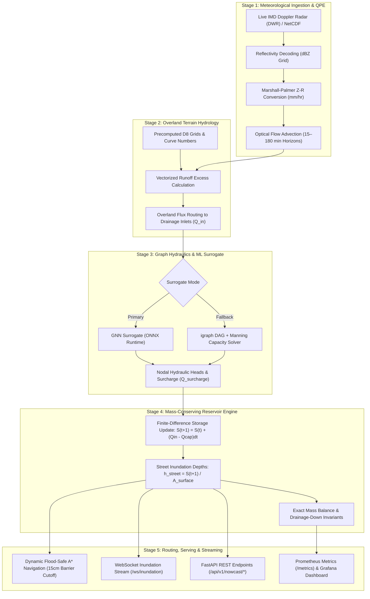

# 🧠 Urban Flood Nowcasting Engine — Complete Architectural & Technical Deep Dive

---

## 📑 Table of Contents

1. [Executive Summary & Core Mission](#1-executive-summary--core-mission)
2. [Why Traditional Hydrology Solvers Fail in Real Time](#2-why-traditional-hydrology-solvers-fail-in-real-time)
3. [The Hybrid Solution: Physics-Informed Neural Surrogates & Mass Conservation](#3-the-hybrid-solution-physics-informed-neural-surrogates--mass-conservation)
4. [Comprehensive Technology Stack & Role of Every Import](#4-comprehensive-technology-stack--role-of-every-import)
   - [4.1 Web, API & Serving Framework](#41-web-api--serving-framework)
   - [4.2 Database, ORM & Asynchronous Queue](#42-database-orm--asynchronous-queue)
   - [4.3 Geospatial, Terrain & Hydrology Stack](#43-geospatial-terrain--hydrology-stack)
   - [4.4 Graph Hydraulics & Physics-Informed Machine Learning](#44-graph-hydraulics--physics-informed-machine-learning)
   - [4.5 Meteorological Ingestion & Imaging](#45-meteorological-ingestion--imaging)
   - [4.6 Observability, Testing & Quality Assurance](#46-observability-testing--quality-assurance)
   - [4.7 Frontend UI, GIS & Data Visualization Stack](#47-frontend-ui-gis--data-visualization-stack)
5. [End-to-End System Architecture: The 5-Stage Live Engine](#5-end-to-end-system-architecture-the-5-stage-live-engine)
   - [Stage 1: Meteorological Ingestion, IMD Radar Decoding & Optical Flow QPE](#stage-1-meteorological-ingestion-imd-radar-decoding--optical-flow-qpe)
   - [Stage 2: Surface Terrain Hydrology & Vectorized Overland Inflow Routing](#stage-2-surface-terrain-hydrology--vectorized-overland-inflow-routing)
   - [Stage 3: Graph Hydraulics & GNN Surrogate Inference](#stage-3-graph-hydraulics--gnn-surrogate-inference)
   - [Stage 4: Mass-Conserving Reservoir-Routing Depth Engine](#stage-4-mass-conserving-reservoir-routing-depth-engine)
   - [Stage 5: Flood-Safe Shortest Path Navigation & Live Streaming](#stage-5-flood-safe-shortest-path-navigation--live-streaming)
6. [Multi-City Scaling & Decoupled Engine Architecture](#6-multi-city-scaling--decoupled-engine-architecture)
7. [Database Schema & Spatio-Temporal Data Modeling](#7-database-schema--spatio-temporal-data-modeling)
8. [Frontend Web GIS Architecture & Subsystems](#8-frontend-web-gis-architecture--subsystems)
9. [Observability, Telemetry & Reliability Architecture](#9-observability-telemetry--reliability-architecture)

---

## 1. Executive Summary & Core Mission

The **Urban Flood Nowcasting Engine** (`urban_flood_engine`) is a production-grade, sub-minute meteorological, hydrological, and emergency navigation platform designed for high-density metropolitan cities.

Modern metropolitan regions in India and across the world face severe recurring flash-flood crises driven by:
1. **Intense convective cloudbursts** dumping 50–120 mm/hr of rain over localized municipal wards in $<30\text{ minutes}$.
2. **Rapid urban imperviousness** (high concrete and asphalt land coverage with SCS Curve Numbers $CN \ge 85$).
3. **Underground stormwater capacity bottlenecks** where pipe conveyance $Q_{cap}$ is quickly exceeded by overland flux $Q_{in}$.
4. **Dangerous street waterlogging** where 15–50 cm of standing water blocks emergency ambulances, submerges vehicles, and creates catastrophic gridlock.

The core mission of this platform is to ingest real-time radar data, predict water accumulation across every street segment up to **3 hours in advance**, and dynamically guide commuters and emergency response vehicles along **provably flood-safe routes**.

---

## 2. Why Traditional Hydrology Solvers Fail in Real Time

Historically, municipal authorities rely on 1D/2D hydrodynamic PDE (Partial Differential Equation) solvers like **EPA-SWMM** (Storm Water Management Model), **HEC-RAS**, or **TUFLOW** to model urban drainage. 

While these tools accurately solve the 1D/2D Saint-Venant shallow water equations:
$$\frac{\partial A}{\partial t} + \frac{\partial Q}{\partial x} = 0 \quad \text{(Continuity)}$$
$$\frac{\partial Q}{\partial t} + \frac{\partial}{\partial x}\left(\frac{Q^2}{A}\right) + g A \frac{\partial H}{\partial x} + g A S_f = 0 \quad \text{(Momentum)}$$

They exhibit critical limitations in operational real-time nowcasting:
- **Severe Computational Latency**: Solving dynamic-wave non-linear differential equations across a 50,000-node municipal drainage network requires **15 minutes to 4 hours** per run. By the time the simulation finishes, the storm has already moved and streets are submerged.
- **Instability Under Cloudburst Inflows**: High Courant-Friedrichs-Lewy (CFL) conditions cause numerical divergence when storm hydrographs spike abruptly.
- **Lack of Real-Time Navigation Integration**: Traditional tools output offline hydrographs rather than live A* routing graph cost weights for vehicular traversal.

---

## 3. The Hybrid Solution: Physics-Informed Neural Surrogates & Mass Conservation

This project solves the computational bottleneck by partitioning the problem into a **Physics vs. ML Split**:

```
┌────────────────────────────────────────────────────────────────────────┐
│                        PHYSICS VS. ML SPLIT                            │
├──────────────────────────────────┬─────────────────────────────────────┤
│      OFFLINE (Hours of Compute)  │      ONLINE (Sub-Millisecond Run)   │
├──────────────────────────────────┼─────────────────────────────────────┤
│ • EPA-SWMM dynamic-wave runs     │ • Doppler Radar Ingestion (<2 sec)  │
│ • High-res DEM pit-fill routing  │ • Optical flow advection (<10 ms)   │
│ • D8 flow directions & CN grids  │ • 1D Overland topological flux      │
│ • Graph Neural Network training  │ • ONNX GNN Surrogate (<5 ms)        │
│ • Formal CSI/POD/FAR calibration │ • Mass-conserving reservoir balance │
│ • ONNX graph optimization        │ • Flood-safe A* shortest path       │
└──────────────────────────────────┴─────────────────────────────────────┘
```

1. **Offline Training**: Heavy hydrodynamic simulations (EPA-SWMM) are run offline across thousands of synthetic and historical storm scenarios to teach a **Graph Neural Network (GNN)** how water moves through network topologies.
2. **Online Inference**: During an active thunderstorm, the pre-trained neural surrogate is evaluated using **ONNX Runtime** in **$<5\text{ milliseconds}$**.
3. **Mass Conservation Guardrail**: The output of the GNN is coupled with a **finite-difference reservoir storage balance equation** ($S(t+1) = \max(0, S(t) + (Q_{in} - Q_{cap})\Delta t)$), ensuring that not a single liter of water is artificially created or destroyed.

---

## 4. Comprehensive Technology Stack & Role of Every Import

Every dependency and import in the codebase was deliberately chosen for performance, mathematical correctness, and scalability.

```
                                  ┌────────────────────────────────────────────────────────┐
                                  │                  CLIENT APPLICATIONS                   │
                                  │   (GIS Dashboards, Web Maps, Mobile Emergency Apps)    │
                                  └───────────▲────────────────────────────────▲───────────┘
                                              │ REST API                       │ WebSockets
                                  ┌───────────┴────────────────────────────────┴───────────┐
                                  │               FastAPI / Uvicorn (Port 8000)            │
                                  │   • Pydantic v2 Schemas  • Auth & Rate Limiter (Redis) │
                                  └───────────▲────────────────────────────────▲───────────┘
                                              │                                │
                       ┌──────────────────────┴───────┐        ┌───────────────┴──────────────────────┐
                       │      ARQ Worker Pipeline     │        │          Database & Storage          │
                       │   • 5-Stage Orchestrator     │        │   • PostgreSQL 16 + PostGIS 3.4      │
                       │   • Radar Poller Daemon      │        │   • TimescaleDB Nowcast Cycles       │
                       │   • Redis 5.0+ Job Broker    │        │   • SQLAlchemy 2.0 Async / Alembic   │
                       └──────────────▲───────────────┘        └──────────────────────────────────────┘
                                      │
        ┌─────────────────────────────┼─────────────────────────────┐
        │                             │                             │
┌───────┴──────────────┐    ┌─────────┴────────────┐    ┌───────────┴──────────┐
│ Scientific & Terrain │    │ Hydraulic & Graph ML │    │ Observability Stack  │
│ • pyflwdir (D8 flow) │    │ • ONNX Runtime (GNN) │    │ • Prometheus /metrics│
│ • rasterio / shapely │    │ • igraph (C-core DAG)│    │ • Grafana Dashboards │
│ • geopandas / scipy  │    │ • pyswmm (Groundtruth│    │ • pytest-asyncio/cov │
└──────────────────────┘    └──────────────────────┘    └──────────────────────┘
```

---

### 4.1 Web, API & Serving Framework

| Library / Import | Specific Role in This Project | Why It Was Chosen |
|---|---|---|
| `fastapi` | Serves REST endpoints (`/api/v1/nowcast/*`, `/api/v1/route/*`, `/api/v1/drainage/*`) and WebSocket streams. | Native asynchronous Python, ASGI speed, automatic OpenAPI documentation, and high-concurrency request handling. |
| `uvicorn[standard]` | High-performance ASGI production web server. | Uses `uvloop` (C-based event loop) and `httptools` for maximum request throughput. |
| `pydantic` (v2) | Data validation, request payload parsing, and response serialization schemas (`NowcastCycleSummarySchema`, `RouteResponseSchema`, etc.). | Written in Rust in v2; executes validation and JSON serialization 5x to 10x faster than Pydantic v1. |
| `pydantic-settings` | Centralized environment variable management in `src/config.py`. | Type-safe settings with `.env` file parsing and dynamic multi-city path helpers. |
| `websockets` | High-frequency, bidirectional live streaming of depth matrices to GIS dashboards (`/ws/inundation`). | Zero-polling, real-time push mechanism ensuring client map interfaces update the instant a nowcast cycle completes. |
| `python-jose` & `passlib` | Cryptographic API key validation and secure token hashing in `src/api/v1/auth.py`. | Secures emergency municipal endpoints against unauthorized tampering. |

---

### 4.2 Database, ORM & Asynchronous Queue

| Library / Import | Specific Role in This Project | Why It Was Chosen |
|---|---|---|
| `arq` | High-throughput asynchronous background job execution for nowcast cycles in `src/workers/pipeline_worker.py`. | Built specifically on top of `asyncio` and Redis; far lighter and faster than Celery for sub-minute recurring jobs. |
| `redis` | In-memory message broker for ARQ task dispatching, client sliding-window rate limiting, and in-memory nowcast state caching. | Sub-millisecond latency for distributed synchronization across multi-process workers. |
| `sqlalchemy` (2.0) | Modern async Object-Relational Mapper (ORM) defining relational and geospatial models in `src/db/models.py`. | Supports declarative 2.0 syntax, async query execution, and connection pooling. |
| `asyncpg` | Asynchronous PostgreSQL database driver for SQLAlchemy. | The fastest PostgreSQL driver in Python, utilizing direct binary protocol decoding. |
| `psycopg2-binary` | Synchronous PostgreSQL driver used by Alembic for schema migrations. | Industry-standard stability for DDL schema operations. |
| `geoalchemy2` | Geospatial PostGIS extensions for SQLAlchemy models. | Enables native spatial querying (`ST_DWithin`, `ST_Contains`, `ST_Distance`) on road centerlines and node coordinates. |
| `alembic` | Database schema migration tool (`alembic/versions/`). | Tracks revision history, enabling reproducible schema updates without data loss. |
| `PostgreSQL 16` + `PostGIS 3.4` + `TimescaleDB` | Storage engine for municipal drainage topologies, road vectors, and time-series nowcasting history. | PostGIS provides spatial topological indexing; TimescaleDB hypertables optimize time-series nowcast tracking. |

---

### 4.3 Geospatial, Terrain & Hydrology Stack

| Library / Import | Specific Role in This Project | Why It Was Chosen |
|---|---|---|
| `pyflwdir` | Digital Elevation Model (DEM) conditioning, depression filling, flat area resolution, and D8 flow direction extraction in `src/offline/dem_preprocess.py`. | Specialized high-performance C-accelerated terrain hydrology engine specifically built for overland flow routing. |
| `rasterio` | Reading and resampling GeoTIFF elevation rasters (`.tif`) in `src/offline/ingest_real_data.py`. | Pythonic bindings to GDAL for geospatial coordinate reference systems (CRS) and affine transformation matrices. |
| `shapely` | Geometric spatial operations (Point, LineString, Polygon) for road networks and drainage canals. | High-performance C geometry engine (`GEOS`) for snapping street coordinates to nearest drainage inlets. |
| `geopandas` | Vector GIS layer processing and spatial joins between road intersections and stormwater outfalls. | Simplifies complex spatial queries across municipal shapefiles and GeoJSON layers. |
| `numpy` | N-dimensional array processing for radar reflectivity matrices, overland runoff flux arrays, and mass-balance vectors. | Vectorized SIMD operations allowing 300x300 grid computations to execute in $<2\text{ milliseconds}$. |
| `scipy` (`scipy.ndimage`) | 2D image shifts for optical flow advection nowcasting (`shift`) and bilinear grid resampling (`zoom`). | Optimized numerical algorithms for semi-Lagrangian spatial shifting without manual loops. |

---

### 4.4 Graph Hydraulics & Physics-Informed Machine Learning

| Library / Import | Specific Role in This Project | Why It Was Chosen |
|---|---|---|
| `igraph` | Municipal stormwater network graph traversal, topological sorting, and downstream tracing in `src/core/drainage_graph.py`. | Implemented in **pure C**; performs graph traversals 10x to 50x faster than pure-Python graph libraries, scaling effortlessly to 50,000+ nodes. |
| `networkx` | Graph modeling utility for road intersection navigation and topological validations. | Standard Pythonic graph data structures for path operations. |
| `onnxruntime` | Executes the pre-trained Graph Neural Network surrogate model in `src/core/surrogate_infer.py`. | Highly optimized C++ inference engine using CPU vectorization (AVX2/AVX-512) to achieve $<5\text{ ms}$ inference latencies without requiring a GPU. |
| `torch` & `torch-geometric` (PyG) | Offline GNN model architecture definition and training on dynamic-wave simulation pairs in `src/offline/gnn_training.py`. | Leading framework for Graph Convolutional Networks (GCN) and message-passing neural networks. |
| `pyswmm` | Offline dynamic-wave ground truth simulation runner in `src/offline/swmm_groundtruth.py`. | Official Python wrapper for the EPA-SWMM computational engine. |
| `scikit-learn` | Model calibration metrics (POD, FAR, CSI, MAE, RMSE) in `src/offline/calibration.py`. | Standardized evaluation tools for hydrological classification and regression accuracy. |

---

### 4.5 Meteorological Ingestion & Imaging

| Library / Import | Specific Role in This Project | Why It Was Chosen |
|---|---|---|
| `httpx` | Asynchronous and synchronous HTTP client for scraping live Doppler radar feeds from the IMD portal (`https://mausam.imd.gov.in/`). | Modern HTTP/1.1 and HTTP/2 client with connection pooling, custom headers, and timeout handling. |
| `Pillow` (`PIL`) | Ingests and processes raw GIF/PNG Doppler radar sweeps, enabling `LOAD_TRUNCATED_IMAGES = True` for resilient real-time streaming. | Fast image decoding and RGB pixel extraction. |

---

### 4.6 Observability, Testing & Quality Assurance

| Library / Import | Specific Role in This Project | Why It Was Chosen |
|---|---|---|
| `prometheus-client` | Telemetry exporter generating `/metrics` for scraping by Prometheus. | Tracks API request counters, cycle latency histograms, and active flood alert gauges. |
| `pytest` & `pytest-asyncio` | Automated unit and integration testing suite for async endpoints and hydraulic solvers. | Modern, robust test runner supporting async fixtures and parameterized test matrices. |
| `pytest-cov` | Code coverage reporting (`--cov=src`). | Ensures high reliability across all critical mathematical and hydraulic modules. |

---

### 4.7 Frontend UI, GIS & Data Visualization Stack

| Library / Import | Specific Role in This Project | Why It Was Chosen |
|---|---|---|
| `react` (19) & `react-dom` | Reactive user interface architecture in `frontend/src/App.tsx`. | Component modularity, concurrent rendering, and efficient DOM reconciliation. |
| `typescript` (6.0) | End-to-end type safety for all domain types (`StreetSegment`, `DrainageNode`, `SafeRouteResult`). | Prevents runtime bugs and enforces interface contracts between backend Pydantic schemas and frontend state. |
| `vite` (8.0) | Lightning-fast frontend build tool and hot-module-replacement (HMR) dev server. | Native ES modules for near-instantaneous page reloads. |
| `leaflet` & `@types/leaflet` | Interactive Web GIS mapping engine in `frontend/src/components/Map/GISMap.tsx`. | Lightweight, mobile-friendly GIS renderer supporting tile layers, GeoJSON lines, custom markers, and canvas overlays. |
| `lucide-react` | Modern, clean vector iconography for emergency alerts, flood warnings, navigation, and weather indicators. | Tree-shakeable SVG icons with zero runtime bloat. |
| `recharts` | Renders interactive hydrograph curves and temporal water-depth charts in `StreetDetailModal.tsx`. | Declarative SVG charting library built specifically for React. |
| `oxlint` | High-speed JavaScript/TypeScript linter. | Instant code hygiene and syntax checking. |

---

## 5. End-to-End System Architecture: The 5-Stage Live Engine



---

### Stage 1: Meteorological Ingestion, IMD Radar Decoding & Optical Flow QPE

#### 1. Real-Time Radar Ingestion
The engine queries the official IMD Doppler Weather Radar portal for the target city's station (e.g., `HYD`, `MUM`, `CHE`, `DEL`, `BLR`, `KOL`).

#### 2. Color-Map Calibrated Decoding
IMD publishes radar imagery as color-mapped GIF/PNG sweeps. `IMDRadarClient.decode_imd_reflectivity()` maps RGB color values to continuous calibrated radar reflectivity factors ($\text{dBZ}$):
- **Magenta / Pink** ($R>180, B>150, G<120$): **$55\text{ to }65\text{ dBZ}$** (Severe Cloudburst)
- **Red / Crimson** ($R>180, G<90, B<90$): **$45\text{ to }55\text{ dBZ}$** (Heavy Convective Storm)
- **Orange** ($R>200, G>100, B<60$): **$38\text{ to }45\text{ dBZ}$** (Intense Showers)
- **Yellow** ($R>180, G>180, B<70$): **$30\text{ to }38\text{ dBZ}$** (Moderate Rain)
- **Green** ($G>140, R<130, B<110$): **$22\text{ to }30\text{ dBZ}$** (Light/Moderate Rain)
- **Cyan / Blue** ($B>160, R<100$): **$10\text{ to }22\text{ dBZ}$** (Drizzle / Trace)

#### 3. Marshall-Palmer Quantitative Precipitation Estimation (QPE)
Reflectivity factor $Z$ ($\text{mm}^6/\text{m}^3$) is converted into rain rate $R$ ($\text{mm/hr}$):
$$Z = 10^{\frac{\text{dBZ}}{10}}$$
$$Z = a R^b \implies R = \left(\frac{Z}{a}\right)^{\frac{1}{b}} \quad (a=200.0, \; b=1.6)$$

#### 4. Semi-Lagrangian Optical Flow Advection
To forecast rainfall fields across future lead times (**15, 30, 45, 60, 120, and 180 minutes**), the engine calculates the storm motion vector $(u, v)$ and applies spatial shifting with convective temporal decay:
$$\text{Grid}(t + \Delta t) = \text{Shift}\left(\text{Grid}(t), \; (v \cdot \text{steps}, \; u \cdot \text{steps})\right) \times e^{-\lambda \cdot \text{horizon}}$$

#### 5. Staleness Fail-Safe
If the radar feed timestamp is older than $\Delta t > 15\text{ minutes}$, the engine marks `data_quality = "degraded"` and switches to Inverse Distance Weighted (IDW) spatial interpolation across municipal rain gauges.

---

### Stage 2: Surface Terrain Hydrology & Vectorized Overland Inflow Routing

#### 1. Offline Terrain Conditioning
High-resolution Digital Elevation Models (DEMs) are processed offline via `pyflwdir`. Depressions (sinks) are filled, and steepest descent **D8 flow direction rasters** are computed.

#### 2. SCS Runoff Curve Number Excess Runoff
Land-use imperviousness determines the Soil Conservation Service (SCS) Curve Number ($CN$). The effective rainfall excess $Q_{excess}$ ($\text{mm}$) is calculated after accounting for initial abstraction $I_a$:
$$S_{ret} = \frac{25400}{CN} - 254, \quad I_a = 0.2 S_{ret}$$
$$Q_{excess} = \begin{cases} \frac{(P - I_a)^2}{P - I_a + S_{ret}}, & \text{if } P > I_a \\ 0, & \text{if } P \le I_a \end{cases}$$

#### 3. Zero-Latency Flattened 1D Routing
Rather than running expensive 2D cellular automata per cycle, `SurfaceRoutingEngine` precomputes **1D ridge-to-valley traversal vectors** (`_src_indices`, `_dst_indices`). At runtime, overland flux is accumulated in a single memory pass and sampled directly at inlet coordinates in **$<2\text{ ms}$**:
$$Q_{in}(i) = \text{RoutedFlux}[\text{InletNode}_i] \quad (\text{m}^3/\text{s})$$

---

### Stage 3: Graph Hydraulics & GNN Surrogate Inference

#### 1. Graph Formulation
The stormwater network is structured as a directed graph $\mathcal{G} = (\mathcal{V}, \mathcal{E})$:
- **Vertices ($\mathcal{V}$)**: Inlets, manholes, storage ponds, outfalls.
- **Edges ($\mathcal{E}$)**: Pipes, culverts, rectangular box drains.
- **Node Feature Matrix ($\mathbf{X}$)**: $[Q_{in}, \; h_{prev}, \; \text{bed\_slope}, \; A_{surface} / 500]$.

#### 2. Spatial Message-Passing GNN Layer
The neural surrogate evaluates hydraulic heads and surcharges using Graph Convolutional layers:
$$\mathbf{h}_i^{(l+1)} = \text{ReLU}\left(\mathbf{W}_{self} \mathbf{h}_i^{(l)} + \sum_{j \in \mathcal{N}(i)} \mathbf{W}_{neigh} \mathbf{h}_j^{(l)} + \mathbf{b}\right)$$

#### 3. Manning Conveyance Fallback
If the ONNX surrogate is disabled or uninitialized, `DrainageGraph` solves gravity flow capacity via Manning's formula:
$$Q_{full} = \frac{1}{n} A R_h^{2/3} S^{1/2}$$
Where $n$ is Manning's roughness coefficient ($\approx 0.015$ for concrete pipes).

---

### Stage 4: Mass-Conserving Reservoir-Routing Depth Engine

A critical flaw in purely data-driven ML models is that they can predict arbitrary water depths that violate physical laws. To prevent this, Stage 4 enforces a **strict finite-difference reservoir routing volume balance**:

#### 1. Mass Balance Storage Equation
For every node $i$ over cycle time step $\Delta t$ ($300\text{ seconds}$):
$$S(t+1) = \max\left(0, \; S(t) + \left(Q_{in}(t) - Q_{out\_capacity}\right) \Delta t\right)$$

#### 2. Surface Inundation Depth Formulation
The excess volume that exceeds underground pipe capacity accumulates on the surface over subcatchment ponding area $A_{surface}$ ($\text{m}^2$):
$$h_{street}(t+1) = \frac{S(t+1)}{A_{surface}} \times 100 \text{ (cm)}$$

#### 3. Physical Invariants Enforced:
- **Zero Artificial Loss/Gain**: All water entering the system either flows through conduits or accumulates on the street.
- **Dry-Down Drainage Behavior**: When precipitation stops ($Q_{in} \to 0$), stored surface water drains down progressively according to node capacity until $S(t) = 0$.

---

### Stage 5: Flood-Safe Shortest Path Navigation & Live Streaming

#### 1. Road Risk Categorization
- 🟢 **Safe** ($h_{street} < 5.0\text{ cm}$): Normal vehicular passage.
- 🟡 **Caution** ($5.0\text{ cm} \le h_{street} < 15.0\text{ cm}$): Waterlogging present; vehicles experience travel delays and dynamic cost penalties.
- 🔴 **Impassable Barrier** ($h_{street} \ge 15.0\text{ cm}$): Completely closed to standard vehicles ($\text{Cost} = \infty$).

#### 2. Dynamic Quadratic Cost Penalty Formulation
For each road segment $e$ of length $L(e)$, the traversal impedance $\text{Cost}(e)$ is computed dynamically:
$$\text{Cost}(e) = \begin{cases} L(e) \times \left(1 + \beta \left(\frac{h_{street}}{h_{safe}}\right)^2\right), & \text{if } h_{street} < 15.0\text{ cm} \\ \infty \text{ (Pruned Edge)}, & \text{if } h_{street} \ge 15.0\text{ cm} \end{cases}$$
Where $h_{safe} = 5.0\text{ cm}$ and $\beta = 8.0$ (penalty multiplier).

#### 3. Shortest-Path A* Search
The routing engine uses Euclidean distance heuristics to compute optimal safe routes around inundated corridors in $<10\text{ ms}$.

#### 4. Route Caching Fallback
If an active query encounters a completely flooded corridor where all paths are impassable, the engine retrieves the last known safe cached route and returns a warning flag `is_cached_fallback = True`.

#### 5. Live WebSocket Broadcasting
The entire updated depth state is broadcast immediately across `/ws/inundation` to all connected client maps.

---

## 6. Multi-City Scaling & Decoupled Engine Architecture

The platform features a fully isolated multi-tenancy design where multiple metropolitan regions can be provisioned, trained, and executed independently:

```
data/cities/
├── hyderabad/
│   ├── dem/                   # Raw GeoTIFF elevation rasters
│   ├── dem_cache/             # Binary D8 grids (fdir.npy, accum.npy, cn.npy)
│   ├── network/               # Municipal topology (drainage_topology.json)
│   ├── radar/                 # Cached radar sweeps (latest_radar_dbz.npy)
│   └── models/                # City-specific ONNX model (surrogate_gnn.onnx)
├── mumbai/
│   ├── dem/, dem_cache/, network/, radar/, models/
├── chennai/
│   ├── dem/, dem_cache/, network/, radar/, models/
└── [delhi, bengaluru, kolkata, ...]
```

### Dynamic Lazy Loading (`CityEngineRegistry`)
`CityEngineRegistry` provides thread-safe dynamic lazy-loading. When a request for Mumbai arrives, the engine loads Mumbai's topology and models without reloading other cities into memory.

---

## 7. Database Schema & Spatio-Temporal Data Modeling

```
  ┌───────────────────────┐                    ┌─────────────────────────┐
  │     DrainageNode      │1                  *│     DrainageConduit     │
  ├───────────────────────┼────────────────────┼─────────────────────────┤
  │ id (PK)               │  outflow_conduits  │ id (PK)                 │
  │ name                  │  inflow_conduits   │ name                    │
  │ node_type             │                    │ from_node_id (FK)       │
  │ latitude, longitude   │                    │ to_node_id (FK)         │
  │ surface_area_m2       │                    │ diameter_m, length_m    │
  │ is_outfall            │                    │ full_capacity_m3s       │
  └───────────┬───────────┘                    └─────────────────────────┘
              │1
              │*
  ┌───────────┴───────────┐                    ┌─────────────────────────┐
  │     StreetSegment     │                    │      NowcastCycle       │
  ├───────────────────────┤                    ├─────────────────────────┤
  │ id (PK)               │                    │ id (PK)                 │
  │ name                  │                    │ cycle_timestamp         │
  │ from_intersection_id  │                    │ horizon_minutes         │
  │ to_intersection_id    │                    │ data_quality            │
  │ nearest_node_id (FK)  │                    │ max_depth_cm            │
  │ coordinates_json      │                    │ status                  │
  └───────────────────────┘                    └────────────┬────────────┘
                                                            │1
                                                            │*
                                               ┌────────────┴────────────┐
                                               │     InundationDepth     │
                                               ├─────────────────────────┤
                                               │ id (PK)                 │
                                               │ cycle_id (FK)           │
                                               │ entity_type, entity_id  │
                                               │ water_depth_cm          │
                                               │ surcharge_flow_m3s      │
                                               │ risk_level              │
                                               └─────────────────────────┘
```

---

## 8. Frontend Web GIS Architecture & Subsystems

The frontend application (`frontend/src/`) delivers a high-impact, real-time command center interface:

### 1. Interactive Leaflet Web GIS (`GISMap.tsx`)
- **Dark Matter CartoDB Base Map**: High-contrast, dark-themed cartography.
- **Dynamic Road Inundation Polylines**: Streets dynamically render color-coded risk lines based on depth:
  - 🟢 Green: $<5\text{ cm}$
  - 🟡 Amber: $5\text{ to }15\text{ cm}$
  - 🔴 Red Pulse: $\ge 15\text{ cm}$ (Submerged / Impassable)
- **Radar Reflectivity Heatmap Overlay**: Calibrated Doppler reflectivity layer showing real-time convective storm cells.
- **Stormwater Topology Layer**: Visualizes underground pipes, inlets, manholes, and outfalls.

### 2. Specialized Functional Panels
- **`LiveRiskFeedPanel.tsx`**: Ranked list of municipal street corridors currently experiencing the highest waterlogging.
- **`FloodSafeRoutePanel.tsx`**: Point-to-point emergency navigation tool with vehicle type selection (Car, Two-Wheeler, Bus, Emergency Ambulance) and step-by-step turn-by-turn safe detour directions.
- **`HistoricalReplayPanel.tsx`**: Time-travel simulation engine allowing operators to replay historical cloudburst events frame-by-frame.
- **`AdminDrainHealthPanel.tsx`**: Municipal maintenance dashboard tracking clogged pipes, siltation levels, and conveyance capacity utilization.
- **`AlertsPanel.tsx`**: Live emergency broadcasting drawer for pushing public flood warnings.
- **`HorizonSlider.tsx`**: Temporal forecast slider allowing operators to scrub between 0, 15, 30, 45, 60, 120, and 180-minute future horizons.

---

## 9. Observability, Telemetry & Reliability Architecture

The engine implements real-time telemetry exported at `GET /metrics` for Prometheus scraping:

- `flood_api_requests_total`: Request throughput by endpoint, method, and HTTP status code.
- `flood_surrogate_inference_seconds`: Histogram tracking sub-millisecond GNN surrogate execution times.
- `flood_e2e_cycle_duration_seconds`: Histogram tracking the complete 5-stage nowcast cycle duration.
- `flood_active_inundation_alerts_total`: Gauge monitoring the total number of submerged streets across the city.
- `flood_data_quality_degraded`: Binary gauge indicating if the radar feed is operating in nominal or degraded mode.

Pre-configured Grafana dashboards (`monitoring/grafana_dashboards/`) provide live visual command-center monitors for disaster management authorities.
